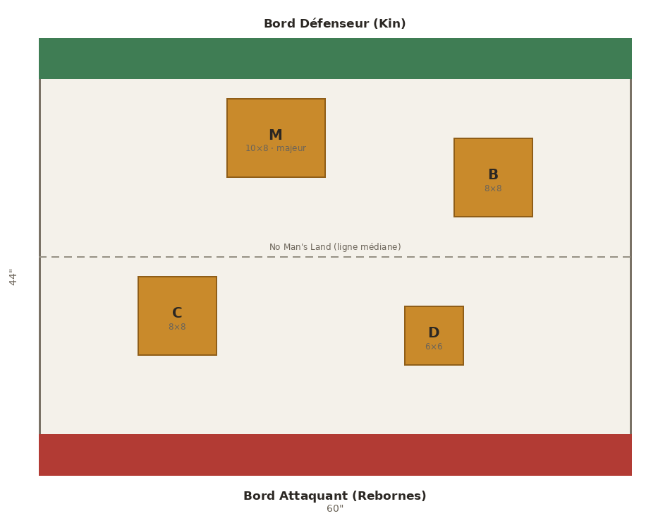
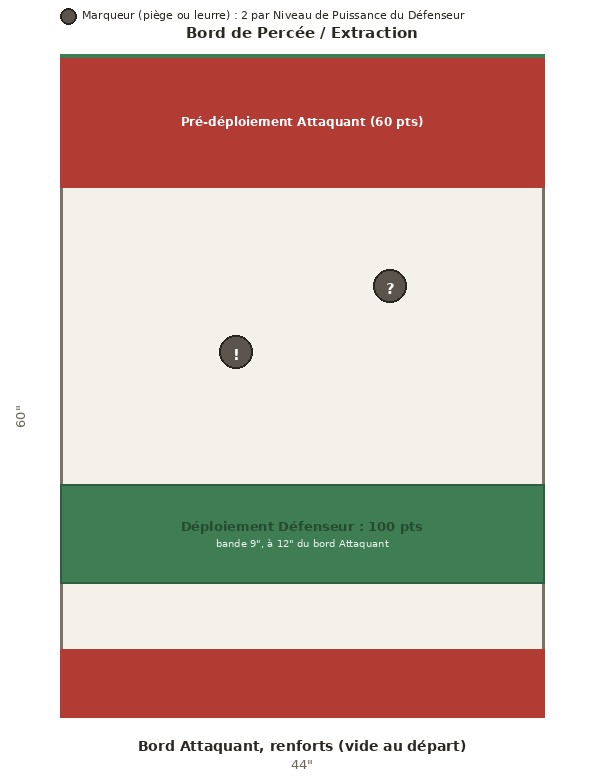
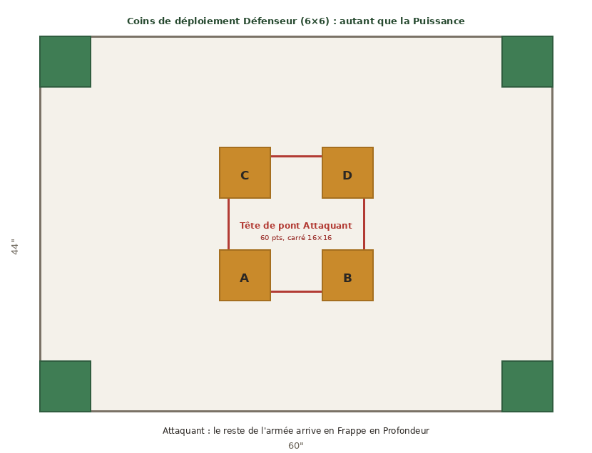
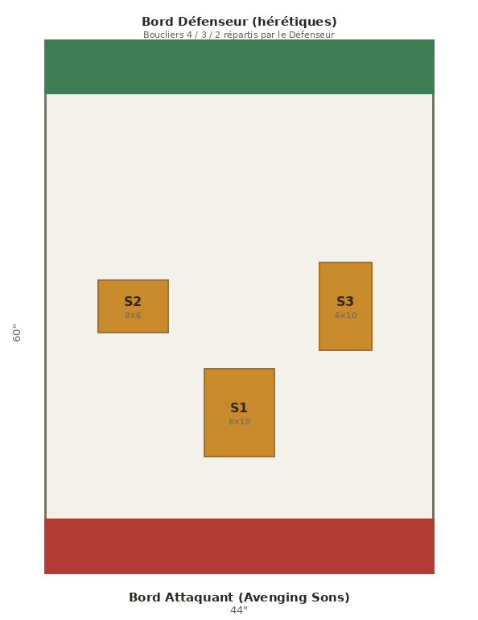
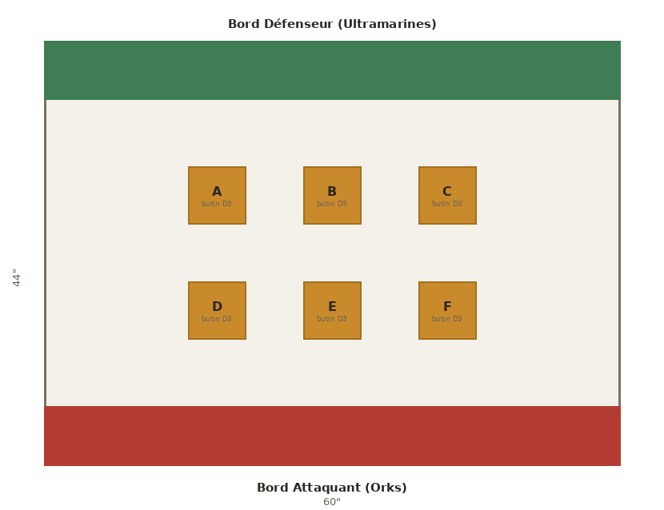
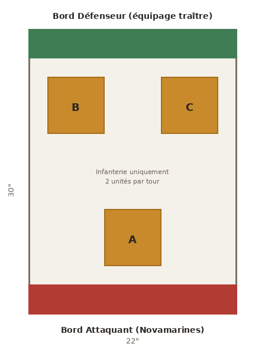

**Front de Vespator**

Missions de Campagne (9e edition)

| Code couleur : Rouge = Attaquant | Vert = Defenseur | Bleu = Egalite / Neutre |
| ----------------------------------------------------------------------------- |

**Mission 1 : Saisir la Base de Pouvoir**

Sur Ikaron Prime, les Rebornes frappent les sites militaires et industriels des Kin pour leur arracher le contrôle de leur base de pouvoir sur ce monde.

Attaquant : Rebornes. Défenseur : Kin. Table 44×60 (voir carte). Points de déploiement : 40 / +30 / +30 / +20 / +20. L'Attaquant joue en premier. La ligne médiane (No Man's Land) partage la table en deux moitiés : la moitié de l'Attaquant (celle contenant son bord de déploiement) et la moitié du Défenseur. L'objectif principal (zone M) représente l'Infrastructure prise pour cible par l'Attaquant.

## Règles de mission

**Garnison (Défenseur).** Au début de l'étape Déploiement des armées, vous pouvez sélectionner un nombre d'unités de votre armée égal à votre Niveau de Puissance sur cette planète (0 à 4). Les unités TITANESQUE comptent pour deux sélections et, si possible, les unités sélectionnées ne doivent pas être des MONSTRE ou des VÉHICULE. Déployez chacune de ces unités n'importe où, entièrement dans votre moitié de table.

**Frappe éclair (Attaquant).** Lors de la phase de Commandement du premier tour de bataille, vous pouvez sélectionner un nombre d'unités de votre armée égal à votre Niveau de Puissance sur cette planète (0 à 4). Les unités TITANESQUE comptent pour deux sélections et, si possible, les unités sélectionnées ne doivent pas être des MONSTRE ou des VÉHICULE. Chacune de ces unités peut effectuer un mouvement normal.

## Objectifs principaux

À partir du deuxième tour de bataille, à la fin de la phase de Commandement, chaque joueur marque des Points de Victoire (PV) pour chaque condition remplie :

- 5 PV par zone d'objectif qu'il contrôle.

- 10 PV supplémentaires s'il contrôle l'objectif principal (zone M).

À la fin de la bataille, le joueur qui contrôle l'objectif principal marque 20 PV.

**Bonus de l'objectif principal** (selon l'Infrastructure prise pour cible par l'Attaquant) :

- **Forteresse :** une fois par tour de bataille, lorsqu'un joueur cible une unité de son armée présente dans la zone M avec un stratagème, ce stratagème ne compte pas dans sa limite d'activation pour ce tour de bataille.

- **Installation de soutien :** lorsqu'un modèle présent dans la zone M est détruit, lancez 1D6. Sur 6, chaque unité à 6" ou moins subit 1 blessure mortelle.

- **Terrain de préparation :** tant qu'un modèle se trouve dans la zone M, les armes à distance de ce modèle bénéficient de **[TOUCHES SOUTENUES 1]**.

- **Lignes de fortification :** chaque fois qu'une attaque cible une unité présente dans la zone M, soustrayez 1 au jet de touche s'il s'agit d'une attaque à distance ou si le modèle attaquant a effectué une charge ce tour de bataille.

## Missions secondaires

Chaque joueur pioche 2 missions secondaires parmi les 3 de son camp au début de la partie. Le score par tranche ou par occurrence est indiqué sur chaque mission.

**Attaquant (Rebornes)**

- **Percée :** à la fin de la phase de Commandement, marquez 2 PV par unité de votre armée entièrement dans la moitié de table du Défenseur (maximum 8 PV).

- **Saignée :** chaque fois qu'une unité ennemie est détruite, marquez 2 PV (maximum 10 PV par tour de bataille).

- **Décapitation :** lorsque le Chef de Guerre ennemi est détruit, marquez 5 PV ; pour chaque PERSONNAGE ennemi détruit, marquez 3 PV.

**Défenseur (Kin)**

- **Bastion :** à la fin de la phase de Commandement, marquez 3 PV si vous contrôlez au moins une zone d'objectif dans votre moitié de table, et 3 PV de plus si vous en contrôlez au moins deux (maximum 6 PV).

- **Riposte :** chaque fois qu'une unité ennemie est détruite dans votre moitié de table, marquez 3 PV (maximum 9 PV par tour de bataille).

- **Sentinelle du Cœur :** à la fin de la phase de Commandement, marquez 5 PV si vous contrôlez la zone M, ou 2 PV si aucun joueur ne la contrôle.

## Résultats de Campagne

**L'Attaquant gagne :**

- L'Alliance Attaquante prend le contrôle d'une Infrastructure de l'Alliance Défenseuse sur cette planète (à l'exception d'une forteresse).

- Si le Niveau de Puissance de l'Alliance Attaquante sur cette planète est de 3 ou plus, elle y construit également un élément d'Infrastructure (à l'exception d'une forteresse).

- Augmentez de 1 le Niveau de Puissance de l'Alliance Attaquante sur cette planète.

**Le Défenseur gagne :**

- L'Alliance Défenseuse peut construire une Ligne de Fortification sur cette planète ou sur une planète connectée.

- Augmentez de 1 le Niveau de Puissance de l'Alliance Défenseuse sur cette planète.

**Égalité :**

- Augmentez de 1 le Niveau de Puissance de l'Alliance Attaquante sur cette planète.

**Mission 2 : Purger et Brûler**

Sur Norallus, les Scythes de l'Empereur encerclent une masse de couvée xenos au Dock de la Mine Halex. Ils doivent empêcher les cultistes de percer et de s'échapper pour contaminer d'autres mondes.

Attaquant : Scythes de l'Empereur. Défenseur : culte xenos. Table 44×60 (voir carte). Le Défenseur joue en premier.

## Déploiement

- **Défenseur :** pas de zone de déploiement. Déployez 100 points de déploiement de votre armée dans la bande centrale de 9" située à 12" du bord Attaquant. Vous ne recevez aucun renfort.

- **Attaquant :** pré-déployez 60 points de déploiement à 12" ou moins du bord de Percée ; ne placez rien du côté du bord Attaquant. Au début de chaque tour de bataille, vous gagnez 20 points de déploiement (les points non dépensés sont conservés) et faites entrer vos unités depuis le bord Attaquant.

## Règles de mission

**Marqueurs de piège (Défenseur).** À la fin de l'étape de déploiement, placez 2 marqueurs par Niveau de Puissance de votre alliance sur cette planète. La face cachée de chaque marqueur indique s'il s'agit d'un véritable piège ou d'un leurre ; vous êtes le seul à la voir. Un marqueur s'active lorsqu'une unité termine un mouvement à 3" ou moins de lui.

- **Leurre :** retirez le marqueur.

- **Piège :** lancez 1D6. Sur 2-4, l'unité subit D3 blessures mortelles ; sur 5+, elle subit 3 blessures mortelles. Retirez ensuite le marqueur.

**Tactiques d'oppression (Attaquant).** Au début du premier tour de bataille, sélectionnez un nombre d'unités du Défenseur égal au Niveau de Puissance de votre alliance sur cette planète. Chaque unité sélectionnée effectue un test d'Ébranlement en soustrayant 1 à son résultat. Jusqu'à la fin du premier tour de bataille, chaque unité ayant échoué voit son Mouvement réduit de moitié (arrondi à l'inférieur) et ne peut pas charger.

**Extraction (Défenseur).** Pendant la phase d'Action, une unité entièrement à 3" ou moins du bord de Percée peut effectuer l'action Extraction : lancez 1D6 ; sur 4+, l'unité quitte le champ de bataille (extraite) ; sur 1-3, l'action échoue.

## Objectifs principaux

**Percée (Défenseur).** À la fin de la bataille, selon le total des points de déploiement de vos unités extraites :

| Points extraits | PV |
| --------------- | -- |
| 0-9             | 0  |
| 10-24           | 30 |
| 25-39           | 45 |
| 40-54           | 60 |
| 55-69           | 75 |
| 70+             | 90 |

**Annihilation (Attaquant).** À la fin de la bataille, selon le total des points de déploiement des unités du Défenseur détruites :

| Points détruits | PV |
| --------------- | -- |
| 0-19            | 0  |
| 20-39           | 20 |
| 40-59           | 40 |
| 60-79           | 60 |
| 80+             | 90 |

## Missions secondaires

Chaque joueur pioche 2 missions secondaires parmi les 3 de son camp au début de la partie.

**Attaquant (Scythes)**

- **Sans Pitié :** chaque fois qu'une unité ennemie est détruite avant le tour 3 de bataille, marquez 2 PV (maximum 10 PV par tour de bataille).

- **Endiguement :** à la fin de la phase de Commandement, marquez 5 PV si aucune unité du Défenseur ne se trouve à 6" ou moins du bord de Percée.

- **Décapitation :** lorsque le Chef de Guerre ennemi est détruit, marquez 5 PV ; pour chaque PERSONNAGE ennemi détruit, marquez 3 PV.

**Défenseur (culte)**

- **Débordement :** à la fin de la phase de Commandement, marquez 5 PV si au moins 2 de vos unités sont entièrement à 12" ou moins du bord de Percée.

- **Fuite en Avant :** chaque fois qu'une de vos unités est extraite avant le tour 3 de bataille, marquez 5 PV supplémentaires.

- **Pièges Mortels :** chaque fois qu'un de vos pièges inflige des blessures mortelles à une unité ennemie, marquez 3 PV.

## Résultats de Campagne

**L'Attaquant gagne :**

- Si le Niveau de Puissance de l'Alliance Attaquante sur cette planète est égal ou supérieur à celui de l'Alliance Défenseuse sur cette planète, soustrayez 1 au Niveau de Puissance de l'Alliance Défenseuse.

- Augmentez de 1 le Niveau de Puissance de l'Alliance Attaquante sur cette planète.

**Le Défenseur gagne :**

- L'Alliance Défenseuse peut soustraire 1 à son Niveau de Puissance sur cette planète autant de fois qu'elle le souhaite ; à chaque fois, elle ajoute 1 à son Niveau de Puissance sur une planète connectée.

- Augmentez de 1 le Niveau de Puissance de l'Alliance Défenseuse sur une planète connectée.

**Égalité :**

- Augmentez de 1 le Niveau de Puissance de l'Alliance Attaquante sur cette planète.

**Mission 3 : Invasion Orbitale**

L'invasion de Jawardet par les Nekrosor est une frappe de scalpel. Les disciples d'Ammentar ouvrent des portails cosmiques pour saisir les accès du complexe de tombe caché, pendant que leurs renforts descendent de l'orbite.

Attaquant : Nekrosor. Défenseur : tenant de Jawardet. Table 44×60 (voir carte). L'Attaquant joue en premier.

## Déploiement

**Attaquant.** Au début de la partie, sélectionnez un nombre d'unités de votre armée égal au Niveau de Puissance de votre alliance sur cette planète ; ces unités gagnent Frappe en Profondeur (les unités TITANESQUE comptent pour deux sélections ; sélectionnez en priorité des unités autres que MONSTRE ou VÉHICULE). Lors de l'étape de déploiement, déployez 60 points de déploiement de votre armée dans la zone centrale (un carré de 16×16 au centre de la table). Le reste de votre armée reste en réserve. Au début de chaque tour de bataille, vous gagnez 20 points de déploiement (les points non dépensés sont conservés) ; vous ne pouvez faire entrer depuis la réserve que des unités disposant de Frappe en Profondeur.

**Défenseur.** Choisissez un nombre de coins de la table égal au Niveau de Puissance de votre alliance sur cette planète : chacun devient une zone de déploiement de 6×6. Vous disposez de 40 points de déploiement au premier tour de bataille, puis gagnez +30 au tour 2, +30 au tour 3, +20 au tour 4 et +20 au tour 5 ; vous faites entrer vos unités depuis vos coins de déploiement.

**Frappe en Profondeur.** Une unité disposant de cette capacité est placée depuis la réserve à plus de 6" de toute figurine ennemie. Placée à plus de 9", elle agit normalement ; placée entre 6" et 9" d'une figurine ennemie, elle ne peut pas charger ce tour de bataille.

## Objectifs principaux

**Défenseur.** À la fin de chaque tour de bataille, vous marquez 5 PV pour chaque condition remplie :

- vous contrôlez au moins une zone d'objectif ;

- vous contrôlez au moins deux zones d'objectif ;

- vous contrôlez au moins trois zones d'objectif ;

- vous contrôlez plus de zones d'objectif que l'Attaquant.

**Attaquant.** À la fin des 3e et 5e tours de bataille, vous marquez 15 PV par zone d'objectif que vous contrôlez.

## Missions secondaires

Chaque joueur pioche 2 missions secondaires parmi les 3 de son camp au début de la partie.

**Attaquant (Nekrosor)**

- **Consolidation :** à la fin de la phase de Commandement, marquez 5 PV si vous contrôlez une zone d'objectif que vous contrôliez déjà au tour de bataille précédent.

- **Périmètre Verrouillé :** à la fin de la phase de Commandement, marquez 5 PV si aucune figurine ennemie ne se trouve à 6" ou moins d'une zone d'objectif que vous contrôlez.

- **Profanation :** chaque fois qu'une unité ennemie est détruite à 6" ou moins d'une zone d'objectif, marquez 3 PV (maximum 9 PV par tour de bataille).

**Défenseur**

- **Contre-Invasion :** à la fin de la phase de Commandement, marquez 5 PV si au moins une zone d'objectif n'est pas sous le contrôle de l'Attaquant.

- **Reconquête :** chaque fois qu'à la fin d'un tour de bataille vous contrôlez une zone d'objectif que l'Attaquant contrôlait au début de ce tour, marquez 5 PV.

- **Sépulcre Scellé :** à la fin de la partie, marquez 15 PV si vous contrôlez la majorité des zones d'objectif.

## Résultats de Campagne

**L'Attaquant gagne :**

- Si le Niveau de Puissance de l'Alliance Attaquante sur cette planète est inférieur à celui de l'Alliance Défenseuse sur cette planète, soustrayez 1 au Niveau de Puissance de l'Alliance Défenseuse.

- Augmentez de 1 le Niveau de Puissance de l'Alliance Attaquante sur cette planète.

**Le Défenseur gagne :**

L'Alliance Défenseuse sélectionne une planète connectée, puis effectue l'une des actions suivantes :

- retirez autant d'éléments d'Infrastructure que vous le souhaitez de l'Alliance Défenseuse sur cette planète ; pour chaque élément retiré, l'Alliance Défenseuse peut construire un élément d'Infrastructure du même type sur la planète connectée ;

- retirez autant d'éléments d'Infrastructure que vous le souhaitez de l'Alliance Défenseuse sur la planète connectée ; pour chaque élément retiré, l'Alliance Défenseuse peut construire un élément d'Infrastructure du même type sur cette planète.

Ensuite, augmentez de 1 le Niveau de Puissance de l'Alliance Défenseuse sur cette planète.

**Égalité :**

- Augmentez de 1 le Niveau de Puissance de l'Alliance Attaquante sur cette planète.

**Mission 4 : Bombardement Planétaire**

Les Avenging Sons s'attaquent aux stations de bouclier anti-orbital des hérétiques sur Marvinius, avant que leurs vaisseaux n'ouvrent le feu dans un barrage apocalyptique.

Attaquant : Avenging Sons. Défenseur : hérétiques. Table 44×60 (voir carte). Déploiement sur les bords de 44", jeu sur la longueur de 60". Points de déploiement : 40 / +30 / +30 / +20 / +20 pour chaque camp. L'Attaquant joue en premier.

## Règles de mission

**Boucliers.** À la mise en place, le Défenseur répartit les valeurs de bouclier 4, 3 et 2 entre les 3 stations (une valeur par station). Le contrôle d'une station se détermine avec l'OC ; une station contestée ne change pas de valeur.

**Avant-garde saboteuse (Attaquant).** Au début de la partie, désignez un nombre d'unités d'Infanterie de votre armée égal à la moitié du Niveau de Puissance de votre alliance sur cette planète (arrondi à l'inférieur) ; ces unités gagnent Infiltrateur.

**Infiltrateur.** Une unité disposant de cette capacité est déployée après les autres unités, n'importe où sur la table, à plus de 9" de toute figurine ennemie et de toute zone de déploiement ennemie.

**Sabotage (Attaquant).** À la fin de chaque tour de bataille, pour chaque station que vous contrôlez, réduisez son bouclier de 1. Si un bouclier atteint 0, la station est détruite : son bouclier reste à 0 et elle ne peut plus être restabilisée.

**Restabilisation (Défenseur).** À la fin de chaque tour de bataille, pour chaque station que vous contrôlez et qui n'est pas détruite, lancez 1D6 ; sur 4+, augmentez son bouclier de 1 (sans plafond).

## Objectifs principaux

**Attaquant.** À la fin de la partie, marquez 30 PV par station détruite (bouclier à 0).

**Défenseur.** À la fin de la partie, marquez 20 PV par station encore debout (bouclier supérieur à 0), et 30 PV supplémentaires si les 3 stations tiennent toujours.

## Missions secondaires

Chaque joueur pioche 2 missions secondaires parmi les 3 de son camp au début de la partie.

**Attaquant (Avenging Sons)**

- **Décapitation :** lorsque le Chef de Guerre ennemi est détruit, marquez 5 PV ; pour chaque PERSONNAGE ennemi détruit, marquez 3 PV.

- **Prise des Émetteurs :** à la fin de la phase de Commandement, marquez 3 PV par station que vous contrôlez et dont le bouclier est à 2 ou moins (maximum 9 PV).

- **Sabotage Éclair :** la première fois qu'une station est détruite avant le tour 3 de bataille, marquez 10 PV.

**Défenseur (hérétiques)**

- **Gardien :** à la fin de la phase de Commandement, marquez 5 PV si vous contrôlez au moins 2 stations non détruites.

- **Contre-Sabotage :** chaque fois que vous restabilisez un bouclier (réussite du jet de Restabilisation), marquez 2 PV.

- **Repousser l'Assaut :** chaque fois qu'une unité ennemie est détruite à 6" ou moins d'une station, marquez 3 PV (maximum 9 PV par tour de bataille).

## Résultats de Campagne

**L'Attaquant gagne :**

- L'Alliance Attaquante choisit un emplacement d'Infrastructure inoccupé ou occupé par une Infrastructure de l'Alliance Défenseuse sur cette planète (si possible, cet emplacement ne doit pas abriter une forteresse). Lancez 1D6 et ajoutez 1 au résultat si le Niveau de Puissance de votre alliance sur cette planète est de 3 ou plus : sur 3+, l'emplacement d'Infrastructure est détruit.

- Augmentez de 1 le Niveau de Puissance de l'Alliance Attaquante sur cette planète.

**Le Défenseur gagne :**

- L'Alliance Défenseuse choisit une planète connectée et un emplacement d'Infrastructure sur cette planète (si possible, cet emplacement ne doit pas abriter une forteresse). Lancez 1D6 : sur 4 ou 5, l'Infrastructure construite sur cet emplacement est détruite ; sur 6, l'emplacement d'Infrastructure est détruit. Si le Niveau de Puissance de l'Alliance Défenseuse sur cette planète est de 3 ou plus, elle peut répéter cette action une fois sur cette planète connectée.

- Augmentez de 1 le Niveau de Puissance de l'Alliance Défenseuse sur cette planète.

**Égalité :**

- Augmentez de 1 le Niveau de Puissance de l'Alliance Attaquante sur cette planète.

**Mission 5 : Raid sur la Base de Ravitaillement**

Sur Quoravis, des pirates Orks pillent les servo-docks de la Reclamation Ultramarine, sautant d'un servo-transporteur à l'autre pour trouver le meilleur butin.

Attaquant : Orks. Défenseur : Ultramarines. Table 44×60 (voir carte). Déploiement sur les bords de 60", jeu sur la largeur de 44". Points de déploiement : 40 / +30 / +30 / +20 / +20 pour chaque camp. L'Attaquant joue en premier.

## Règles de mission

**Butin.** Au début de la partie, lancez 1D3 pour chaque zone d'objectif et notez le résultat : c'est la valeur de butin de départ de cette zone. Le contrôle d'une zone se détermine avec l'OC.

**Réorganisation (Défenseur).** Avant la bataille, vous pouvez transférer 1 point de butin d'une zone à une autre, un nombre de fois égal au Niveau de Puissance de votre alliance sur cette planète.

**Pillage (Attaquant).** Pendant la phase de Commandement, une de vos unités présente dans une zone d'objectif peut effectuer l'action Pillage : réduisez de 1 le butin de cette zone et infligez D3 blessures mortelles à une unité ennemie se trouvant dans une zone d'objectif.

## Objectifs principaux

**Attaquant.** À la fin de chaque tour de bataille, marquez 5 PV pour chaque zone d'objectif comportant du butin que vous contrôlez. Retirez ensuite 1 point de butin de chaque zone que vous contrôlez.

**Défenseur.** À la fin de la bataille, marquez 15 PV pour chaque zone d'objectif que vous contrôlez comportant au moins 1 point de butin.

## Missions secondaires

Chaque joueur pioche 2 missions secondaires parmi les 3 de son camp au début de la partie.

**Attaquant (Orks)**

- **Décapitation :** lorsque le Chef de Guerre ennemi est détruit, marquez 5 PV ; pour chaque PERSONNAGE ennemi détruit, marquez 3 PV.

- **Saccage :** chaque fois qu'une unité ennemie est détruite, marquez 2 PV (maximum 8 PV par tour de bataille).

- **Razzia Totale :** à la fin de la phase de Commandement, marquez 5 PV si vous contrôlez au moins 4 zones d'objectif.

**Défenseur (Ultramarines)**

- **Escorte :** à la fin de la phase de Commandement, marquez 3 PV par zone d'objectif que vous contrôlez et dont le butin est de 2 ou plus (maximum 9 PV).

- **Contre-Raid :** chaque fois qu'une unité ennemie est détruite dans une zone d'objectif ou à 3" d'une zone, marquez 2 PV (maximum 8 PV par tour de bataille).

- **Ligne d'Approvisionnement :** à la fin de la phase de Commandement, marquez 5 PV si vous contrôlez au moins 3 zones d'objectif comportant du butin.

## Résultats de Campagne

**L'Attaquant gagne :**

- L'Alliance Attaquante choisit cette planète ou une planète connectée et lance 1D6 : sur 4+, soustrayez 1 au Niveau de Puissance de l'Alliance Défenseuse sur la planète choisie. Si le Niveau de Puissance de l'Alliance Attaquante sur cette planète est de 3 ou plus, elle peut répéter cette action une fois.

- Augmentez de 1 le Niveau de Puissance de l'Alliance Attaquante sur cette planète.

**Le Défenseur gagne :**

- Soustrayez 1 au Niveau de Puissance de l'Alliance Attaquante sur cette planète. Si le Niveau de Puissance de l'Alliance Défenseuse sur cette planète est de 3 ou plus, elle peut effectuer cette action sur une planète connectée.

- Augmentez de 1 le Niveau de Puissance de l'Alliance Défenseuse sur cette planète.

**Égalité :**

- Augmentez de 1 le Niveau de Puissance de l'Alliance Attaquante sur cette planète.

**Mission 6 : Action d’Abordage**

Sous le Capitaine Vortes, une force d'abordage Novamarine, opérant depuis une seule frégate, fut le sauveur des flottes alliées à maintes reprises. Leurs frappes audacieuses sur les vaisseaux traîtres au-dessus de Kryndaer leur valurent le nom de Voidblades de Vespator.

Attaquant : Novamarines. Défenseur : équipage traître. Terrain 22×30. Infanterie uniquement. L'Attaquant joue en premier.

## Déploiement

Aucune unité n'est déployée au départ : toute l'armée commence en réserve. À chaque tour de bataille, chaque joueur peut faire entrer jusqu'à 2 unités depuis son bord de déploiement (le bord de 22" de son côté), placées à 3" ou moins de ce bord. Seules les unités d'Infanterie peuvent être jouées dans cette mission.

## Objectifs principaux

À partir du deuxième tour de bataille, à la fin de la phase de Commandement, chaque joueur marque 5 PV par point de contrôle qu'il contrôle, et 5 PV supplémentaires s'il contrôle les trois points de contrôle.

## Missions secondaires

Chaque joueur pioche 2 missions secondaires parmi les 3 de son camp au début de la partie.

**Attaquant (Novamarines)**

- **Décapitation :** lorsque le Chef de Guerre ennemi est détruit, marquez 5 PV ; pour chaque PERSONNAGE ennemi détruit, marquez 3 PV.

- **Assaut des Coursives :** à la fin de la phase de Commandement, marquez 3 PV par unité de votre armée entièrement à 6" ou moins du bord du Défenseur (maximum 9 PV).

- **Nettoyage :** chaque fois qu'une unité ennemie est détruite, marquez 2 PV (maximum 8 PV par tour de bataille).

**Défenseur (équipage traître)**

- **Verrouillage :** à la fin de la phase de Commandement, marquez 5 PV si l'Attaquant ne contrôle aucun point de contrôle.

- **Contre-Abordage :** à la fin de la phase de Commandement, marquez 5 PV si vous contrôlez le point de contrôle le plus proche du bord Attaquant.

- **Fusillade :** chaque fois qu'une unité ennemie est détruite, marquez 2 PV (maximum 8 PV par tour de bataille).

## Résultats de Campagne

**L'Attaquant gagne :**

- L'Alliance Attaquante peut sélectionner l'une des flottes de l'Alliance Défenseuse sur cette planète et la déplacer jusqu'à deux fois, en suivant les règles de l'étape Déplacement des flottes.

- Augmentez de 1 le Niveau de Puissance de l'Alliance Attaquante sur cette planète.

**Le Défenseur gagne :**

- La flotte de l'Alliance Attaquante ne peut pas se déplacer lors de l'étape Déplacement des flottes de cette phase de campagne.

- L'Alliance Défenseuse peut sélectionner l'une de ses flottes sur cette planète et la déplacer une fois, en suivant les règles de l'étape Déplacement des flottes.

- Augmentez de 1 le Niveau de Puissance de l'Alliance Défenseuse sur cette planète.

**Égalité :**

- Augmentez de 1 le Niveau de Puissance de l'Alliance Attaquante sur cette planète.
