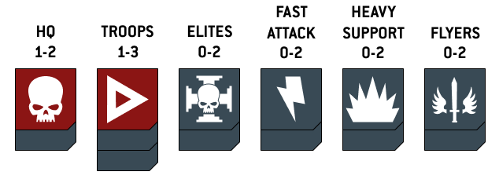
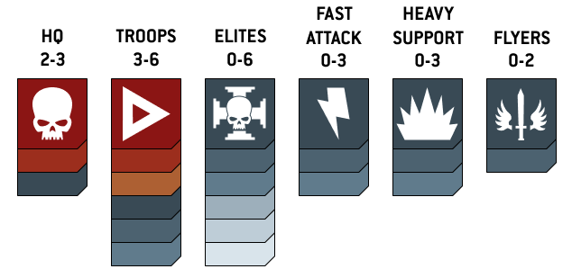
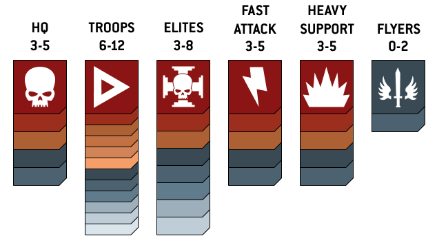
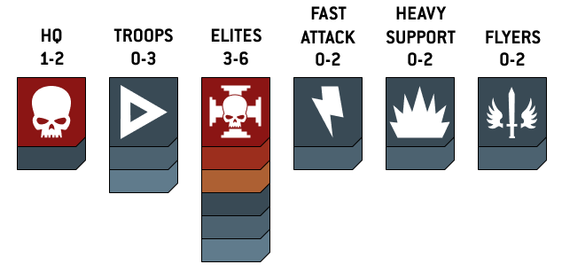
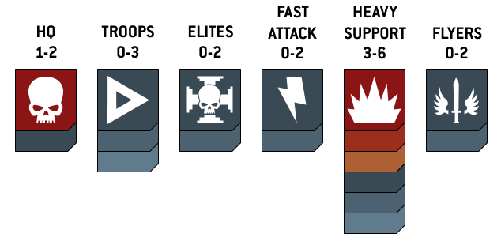
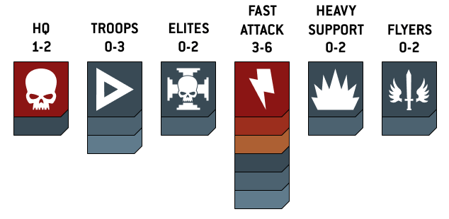

**Règles de Base**

*Warhammer 40,000*

Version Maison

*"Nous sommes assaillis de tous côtés par de vils xénos prédateurs et la sédition nous ronge de l'intérieur ; en cette heure sombre, le mieux que nous puissions faire est de nous en remettre à notre matériel et de prier nos dieux."*

*Skolak a'Trellar IV, Commandant Impérial*

# Définitions

Portée d'Engagement : deux modèles de camps adverses sont à Portée d'Engagement lorsqu'ils sont à 1" ou moins l'une de l'autre. Cette distance détermine le corps à corps ainsi que les restrictions de tir et de mouvement.

# Structure du Round de Bataille

Toutes les distances se mesurent en pouces (") avec un mètre-ruban, et tous les jets utilisent des dés à six faces (D6).

Une partie se joue en une série de rounds. Chaque round comporte trois phases, jouées dans cet ordre :

1. **Phase de Commandement**

2. **Phase d'Action**

3. **Phase de Combat**

| **Phase** | **Description** |
| ------------------------- | ---------------------------------------------------------------------------------------------------------------------------------------------- |
| 1. Phase de Commandement | Les joueurs gagnent leurs points de victoire, résolvent leurs capacités et effectuent leurs tests d'Ébranlement. Est jouée l'un après l'autre. |
| 2. Phase d'Action        | Les joueurs activent leurs unités en alternance. Chaque activation permet un mouvement puis une action.                                        |
| 3. Phase de Combat       | Toutes les unités engagées en corps à corps combattent simultanément.                                                                          |

Le premier joueur du round 1 est déterminé avant la partie. À chaque round suivant, l'ordre s'inverse : celui qui a joué second devient premier.

# Phase de Commandement

La phase de Commandement est jouée l'une après l'autre : le joueur ayant le premier tour résout entièrement sa phase, puis son adversaire fait de même. Elle se déroule en trois étapes, dans cet ordre :

## 1. Tests d'Ébranlement

Dès qu'une unité est réduite à la moitié ou moins de son effectif initial, elle effectue immédiatement un test d'Ébranlement (2D6 ≥ Cd).

Les unités composées d'une seule modèle (monstres, véhicules, personnages seuls) n'effectuent jamais de test d'Ébranlement.

Une unité qui réussit son test reste stable : elle ne le refait pas, même si elle perd d'autres modèles par la suite.

**Réussite : l'unité agit normalement.**

**Échec : l'unité bat en retraite. Si elle n'a pas encore été activée ce round, elle perd son activation. Elle effectue immédiatement son mouvement de retraite (voir Retraite).**

**Échec à portée d'engagement : avant de fuir, l'unité subit une Fuite Désespérée (1D6 par modèle ; sur 1 ou 2, un modèle est détruit, au choix du joueur), puis effectue son mouvement de retraite.**

Tant qu'une unité est en retraite, elle effectue un nouveau test d'Ébranlement à chaque phase de Commandement : réussite, elle cesse d'être en retraite et agit normalement ; échec, elle effectue un nouveau mouvement de retraite.

## 2. Compétences et Stratagèmes

Chaque joueur résout les capacités et règles s'activant en phase de Commandement, et peut dépenser ses Stratagèmes. Les Stratagèmes sont des ressources à usage unique achetées avant la partie (voir section dédiée).

## 3. Points de Victoire

Chaque joueur marque les points de victoire que lui accordent les conditions de sa mission.

# Phase d'Action

Les joueurs activent leurs unités en alternance, en commençant par le premier joueur. À chaque activation, le joueur choisit une de ses unités non encore activées : elle effectue d'abord un mouvement, puis une action.

On alterne jusqu'à ce que toutes les unités aient été activées. Si un joueur n'a plus d'unité à activer, son adversaire active les siennes l'une après l'autre.

## Mouvement

Au début de son activation, l'unité choisit l'un des mouvements suivants :

### Rester Immobile

L'unité ne se déplace pas, puis effectue son action normalement.

### Mouvement Normal

Chaque modèle se déplace jusqu'à sa valeur de Mouvement (M). Aucun modèle ne peut finir son mouvement à Portée d'Engagement d'un modèle ennemi.

### Avance

L'unité ajoute ½ M (arrondi à l'inférieur) à sa valeur de Mouvement pour ce déplacement. Ce tour, elle ne peut tirer qu'avec des armes **[ASSAUT]** ou **[PISTOLET]**.

### Désengagement

L'unité effectue un mouvement de sa valeur de Mouvement (M) pour quitter la Portée d'Engagement des unités ennemies. Elle n'effectue aucune action ce tour.

Si une unité traverse des modèles ennemis pendant son mouvement, elle subit une Fuite Désespérée : 1D6 par modèle ennemi traversé ; sur 1 ou 2, un modèle de l'unité est détruit.

| **Étape** | **Options disponibles** |
| ------------- | ----------------------------------------------------------------- |
| 1. Mouvement | Se déplacer (Normal, Avance ou Désengagement), ou Rester Immobile |
| 2. Action    | Tir, Charge, ou toute autre action spéciale                       |

## Actions

### Tir

L'unité tire avec ses armes sur des unités ennemies à vue (ligne de vue réelle) et à portée. Chaque modèle choisit librement sa cible : deux modèles, même équipées de la même arme, peuvent viser des unités différentes.

Unité ayant Avancé : ne peut tirer qu'avec des armes **[ASSAUT]** ou **[PISTOLET]**.

Unité à Portée d'Engagement d'un ennemi : ne peut tirer qu'avec des armes **[PISTOLET]**, et uniquement contre une unité qui l'engage.

### Charge

Une unité qui n'a ni Avancé ni effectué un Désengagement peut déclarer une charge. La séquence est la suivante :

**1. Déclarer** la charge contre une ou plusieurs unités ennemies à vue.

**2. Réactions :** chaque unité ciblée éligible peut effectuer une Réaction à une Charge (voir ci-dessous).

**3. Jet de Charge :** M + 1D6".

**4. Réussite** si l'unité peut amener un modèle à Portée d'Engagement d'au moins un modèle de chaque unité ciblée. Sinon la charge échoue, mais l'unité effectue tout de même son mouvement pour se rapprocher au maximum de sa cible.

**5. Déplacer** les modèles en recherchant le contact socle à socle.

**6. Consolidation :** mouvement de 3" pour rapprocher les modèles le plus possible, au socle à socle.

**7. Bonus de charge :** l'unité ayant chargé gagne +1 en Force jusqu'à la fin du tour.

### Réactions à une Charge

Seule une unité ciblée non encore activée ce round et non engagée au corps à corps peut réagir. Réagir consomme son action : l'unité est alors considérée comme activée et ne rejouera pas ce round. Les réactions se résolvent après la déclaration de charge, avant le Jet de Charge.

**Repli :** l'unité effectue un mouvement de ½ M pour tenter de sortir de la portée de la charge.

**Préparation à la Charge :** la charge réussit automatiquement pour les deux unités (pas de Jet de Charge). Les modèles se rencontrent au socle à socle, à mi-chemin de la charge. Les deux unités gagnent le bonus de charge (+1 en Force jusqu'à la fin du tour).

**Tirs en État d'Alerte :** l'unité effectue des tirs au jugé contre l'unité qui charge. Si le chargeur Se Jette à Terre suite à ces tirs, sa charge échoue automatiquement.

# Phase de Combat

La Phase de Combat est la troisième phase du round. Toutes les unités à Portée d'Engagement d'un ennemi combattent.

## Séquence de Combat

### 1. Attaques de Mêlée

Le combat est simultané : les deux joueurs combattent en même temps, aucune unité ne frappe avant l'autre. Quand deux unités s'affrontent, les deux camps lancent leurs attaques en même temps, puis retirent les pertes ensemble. Un modèle détruit riposte quand même : il porte ses attaques avant d'être retiré.

Exception : une unité dotée de l'aptitude **Attaque en premier** résout ses attaques avant l'unité adverse. Ses pertes sont retirées avant que l'ennemi ne riposte.

Un modèle peut combattre si elle est à Portée d'Engagement d'une unité ennemie, ou si elle est en contact socle à socle avec un modèle de sa propre unité elle-même engagée avec l'ennemi.

Chaque modèle éligible choisit une arme de mêlée et une unité cible à Portée d'Engagement, puis résout ses attaques.

### 2. Consolider

Une unité qui a combattu et qui n'est plus à Portée d'Engagement d'aucun ennemi peut déplacer chacun de ses modèles de jusqu'à 3" vers le modèle ennemi la plus proche ou la zone d'objectif la plus proche. Une unité encore engagée ne consolide pas.

# Tirs au Jugé

Dans certaines circonstances, un modèle ne peut effectuer qu'un tir au jugé :

- une arme **[LOURD]** dont l'unité a effectué un mouvement pendant la phase d'Action ;

- un tir en état d'alerte (réaction à une charge).

La CT du modèle est considérée comme 6+ pour ce tir, quels que soient ses modificateurs habituels. Un modèle dont la CT est déjà 6+ (hors modificateur) ne peut pas tirer au jugé. Seules les règles spéciales mentionnant explicitement les tirs au jugé peuvent modifier cette CT de 6+.

Les armes avec la règle **[DÉFLAGRATION]** ne peuvent pas effectuer de tirs au jugé. Les tirs au jugé ne peuvent pas être critiques.

# Aptitudes d'Arme

## Plus d'une Arme

Tir : un modèle d'Infanterie ne tire qu'avec une seule de ses armes par phase, même si elle en possède plusieurs, et ne peut pas combiner les effets de plusieurs armes. Les modèles de véhicules et de monstres tirent avec toutes leurs armes.

Mêlée : un modèle ne combat qu'avec une seule arme de mêlée par phase.

| Mot-clé | Effet |
| --- | --- |
| [ASSAUT] | Le modèle peut tirer en plus de pouvoir charger ou Avancer au cours du même tour. |
| [LANCE] | Si le porteur a effectué un mouvement de Charge ce tour, ajoutez +2 à la Force des attaques faites avec cette arme au lieu de +1. |
| [PISTOLET] | Peut être utilisé même si le modèle est à Portée d'Engagement d'une unité ennemie, mais uniquement contre cette unité. Les armes avec ce mot-clé sont considérées comme [ASSAUT]. Un modèle équipé de deux Pistolets peut tirer avec les deux lors de la même phase. |
| [TIR INDIRECT] | Peut cibler des unités non visibles. Si aucun modèle de l'unité cible n'est visible, la cible bénéficie de ses sauvegardes de couvert améliorées. |
| [TIR RAPIDE X] | Si la cible est à mi-portée ou moins, la caractéristique d'Attaques est augmentée de X. |
| [DÉFLAGRATION] | Ajoutez 1 au nombre d’Attaque par tranche de 5 modèles dans l'unité cible au moment du choix. Ne peut être utilisé pour un Tir en état d’alerte. Ne peut jamais cibler une unité à Portée d'Engagement d'une unité amie. Peut allouer des blessures à des modèles non visibles. |
| [LOURD] | Si le modèle s'est déplacé, il ne peut tirer qu'au jugé (CT 6+). Le modèle ne peut pas charger après avoir tiré. |
| [FUSION X] | Si la cible est à mi-portée ou moins, la caractéristique de Dégâts est augmentée de X. |
| [TORRENT] | Chaque attaque touche automatiquement (pas de jet de Touche). Lors d'un tir au jugé, divisez par 2 le nombre de touches (arrondi au supérieur). |
| [PRÉCISION] | Si cette arme blesse une unité, le joueur attaquant peut choisir d'allouer la blessure directement à un modèle visible du porteur, en ignorant la règle normale d'allocation. |
| [IGNORE LE COUVERT] | La cible ne peut pas bénéficier d'une sauvegarde de couvert contre les attaques de cette arme. |
| [À RISQUE] | Après avoir tiré ou combattu, jetez 1D6. Sur 1, le modèle est détruit (ou subit 3 blessures mortelles si c'est un Personnage, Monstre ou Véhicule). |
| [TOUCHES FATALES] | Une Touche Critique blesse automatiquement la cible, sans jet pour blesser. |
| [TOUCHES SOUTENUES X] | Une Touche Critique cause X touches supplémentaires à la cible. |
| [JUMELÉ] | À chaque attaque faite avec cette arme, vous pouvez relancer le jet pour toucher. |
| [ATTAQUES BONUS] | Le porteur peut effectuer des attaques avec cette arme en plus de l'arme choisie pour combattre. Le nombre d'attaques bonus ne peut pas être modifié. |
| [ANTI - MOT-CLÉ X+] | Un jet pour blesser non modifié égal ou supérieur à X contre une cible ayant le mot-clé correspondant cause une Blessure Critique. |
| [BLESSURES DÉVASTATRICES] | Une Blessure Critique double la caractéristique de Dégâts de l'arme, à la place des dégâts normaux. |
| [DANGEREUX] | Après que l'unité a résolu ses attaques, effectuez un test de dangerosité par arme dangereuse employée : 1D6, sur 1 un modèle porteur subit 3 blessures mortelles. Procédure complète : voir Mots-clés et Aptitudes. |

# Mots-clés et Aptitudes

Cette section détaille les mots-clés et aptitudes dont l'effet ne tient pas dans le tableau des Aptitudes d'Arme.

## [DANGEREUX]

Chaque fois qu'une unité est sélectionnée pour tirer ou combattre, après qu'elle a résolu toutes ses attaques, elle doit effectuer un test de dangerosité pour chaque arme dangereuse dont les cibles ont été sélectionnées lors de la résolution de ces attaques. Pour ce faire, lancez 1D6 : sur un 1, le test est raté. Résolvez chaque test raté un par un, dans cet ordre :

  - Si possible, sélectionnez un modèle de cette unité ayant subi au moins une blessure et équipé d'une ou plusieurs armes dangereuses.

  - Sinon, si possible, sélectionnez un modèle de cette unité, hors PERSONNAGE, équipé d'une ou plusieurs armes dangereuses.

  - Sinon, sélectionnez un PERSONNAGE de cette unité équipé d'une ou plusieurs armes dangereuses.

Le modèle sélectionné subit 3 blessures mortelles ; lors de la répartition, ces blessures doivent lui être infligées.

Si une unité est choisie comme cible d'un tir en état d'alerte durant une charge adverse, les blessures mortelles infligées par les tests de dangerosité sont réparties après la fin du mouvement de charge de l'unité chargée.

## [Insensible à la douleur X+]

Chaque fois qu'un modèle doté de cette aptitude subit des dégâts et devrait donc perdre une blessure, y compris une blessure mortelle, lancez 1D6 : si le résultat est supérieur ou égal à X, cette blessure est ignorée et n'est pas perdue. Si un modèle possède plusieurs aptitudes « Insensible à la douleur », vous ne pouvez en utiliser qu'une seule à chaque fois qu'il subit des dégâts.

## Objectif Sécurisé

À la fin de la phase de Commandement, si cette unité se trouve dans une zone d'objectif que vous contrôlez, cette zone reste sous votre contrôle même si vous n'y avez plus aucun modèle, jusqu'à ce que votre adversaire en prenne le contrôle au début ou à la fin d'un tour.

## Intervention Héroïque

Aptitude propre à certaines unités ; elle n'est pas accessible à toutes les unités et ne figure pas parmi les Réactions à une Charge.

Une unité dotée de cette aptitude, située à 6" ou moins d'une unité prise pour cible d'une charge adverse, peut utiliser son action pour effectuer un Mouvement Normal. Elle doit finir ce mouvement le plus près possible de l'unité ennemie qui charge et ne peut finir à Portée d'Engagement que de cette unité ; si c'est le cas, la charge est annulée.

Cette action est considérée comme une charge, mais ne donne pas le bonus de charge.

## Frappe en Profondeur

Une unité disposant de cette aptitude est placée depuis la réserve à plus de 6" de tout modèle ennemi. Placée à plus de 9", elle agit normalement ; placée entre 6" et 9" d'un modèle ennemi, elle ne peut pas charger ce tour de bataille.

## Infiltrateur

Une unité disposant de cette aptitude est déployée après les autres unités, n'importe où sur la table, à plus de 9" de tout modèle ennemi et de toute zone de déploiement ennemie.

## Éclaireurs X

Juste après le déploiement et avant le premier tour, l'unité peut effectuer un mouvement de X" ; elle ne peut pas finir ce mouvement à Portée d'Engagement d'une unité ennemie.

## Hors de Combat

À la fin de la bataille, effectuez un test pour chaque unité détruite : lancez 1D6 ; sur un 1, l'unité est gravement blessée.

[À COMPLÉTER : tableau des blessures graves]

# Allocation des Blessures et Retrait des Pertes

Un pool de blessures regroupe l'ensemble des blessures non sauvegardées causées par des armes identiques, en attente d'allocation. Les blessures sont allouées depuis ce pool une à une : pour chaque blessure allouée, le défenseur effectue immédiatement son jet de sauvegarde avant de passer à la suivante. Si plusieurs pools existent, l'attaquant choisit l'ordre de la résolution. Toutes les blessures d'un pool doivent être allouées avant de passer au suivant.

## Priorité d'Allocation

  - Modèle le plus proche : allouez chaque blessure au modèle de l'unité cible le plus proche de l'unité attaquante, quel que soit le modèle qui a causé la blessure.

  - Égalité de distance : si deux modèles ou plus sont à égale distance, le défenseur choisit laquelle est affectée. Ce choix est figé jusqu'à la fin de l'attaque ou le retrait du modèle.

  - Allocation aléatoire : si la direction de l'attaque ne peut pas être déterminée (danger environnemental, règle spéciale), désignez aléatoirement un modèle. Elle est traitée comme la plus proche jusqu'à la fin de l'attaque ou son retrait. Si elle est retirée, effectuez un nouveau tirage.

## Restrictions d'Allocation

  - Hors de portée : aucune blessure ne peut être allouée à un modèle hors de portée maximale de l'arme. Si toutes les modèles restantes sont hors de portée, les blessures du pool sont perdues.

  - Hors de vue : allouez au modèle visible le plus proche à la place. Si aucun modèle n'est visible, les blessures restantes sont perdues.

# Jet pour Toucher

Pour toucher, lancez 1D6 par attaque : le tir ou l'attaque touche si le résultat est égal ou supérieur à la CT (tir) ou à la CC (corps à corps) du modèle. Un résultat non modifié de 1 est toujours un échec.

Touche Critique : un résultat non modifié de 6 au jet pour toucher est une Touche Critique.

# Jet pour Blesser

Comparez la Force (F) de l'arme à l'Endurance (E) de la cible, puis consultez le tableau ci-dessous.

| **Comparaison Force / Endurance** | **Résultat requis** |
| ---------------------------------------------------- | -------------------- |
| F supérieure à 2 × E                                 | Blessure automatique |
| F égale à 2 × E                                      | 2+                   |
| F supérieure à E (sans atteindre le double)          | 3+                   |
| F égale à E                                          | 4+                   |
| F inférieure à E (sans descendre à la moitié)        | 5+                   |
| F égale à la moitié de E (2 × F = E)                 | 6+                   |
| F inférieure à la moitié de E (2 × F inférieure à E) | Blessure impossible  |

  - Un résultat non modifié de 1 est toujours un échec (sauf blessure automatique).

  - Les modificateurs ne peuvent jamais dépasser -1 ou +1.

Blessure Critique : un résultat non modifié de 6 au jet pour blesser est une Blessure Critique.

En cas de blessure automatique, aucun jet n'est requis et la blessure est compter comme une Blessure mortelle.

Blessure mortelle : Ignore toute les sauvegardes d'armures (invulnérable comprise).

# Jets de Sauvegarde

Lorsqu'une blessure est allouée à un modèle, son joueur peut tenter un jet de sauvegarde pour l'annuler. Jetez 1D6 et appliquez les modificateurs éventuels (Pénétration d'Armure) : si le résultat est égal ou supérieur à la valeur de sauvegarde, la blessure est ignorée.

  - Un résultat non modifié de 1 est toujours un échec.

  - Un modèle peut disposer de plusieurs types de sauvegarde : il n'en utilise qu'une seule par blessure, au choix du défenseur.

| **Type** | **Modifiée par la PA ?** | **Ignorable par règle spéciale ?** |
| ----------------------- | ------------------------ | ---------------------------------- |
| Sauvegarde d'armure     | Oui                      | Oui                                |
| Sauvegarde invulnérable | Non                      | Non                                |

## Couvert

Le niveau de couvert dépend de la hauteur de l'élément de terrain qui protège le modèle et du type d'unité. Les unités Titanesques ne bénéficient jamais du couvert.

Effets passifs du couvert (toujours actifs, sans action) :

À découvert : aucun effet.

Couvert léger : les tirs ennemis subissent -1 pour toucher l'unité.

Couvert complet : les tirs ennemis subissent -1 pour toucher l'unité et l'unité gagne +1 à sa sauvegarde d'armure.

| **Hauteur de l'élément de terrain** | **Infanterie / Monté / Bête** | **Véhicule / Monstre** |
| ----------------------------------- | ----------------------------- | ---------------------- |
| Aucun élément                       | À découvert                   | À découvert            |
| 0" à 1"                             | Couvert léger                 | À découvert            |
| Plus de 1" à 4"                     | Couvert complet               | Couvert léger          |
| Plus de 4"                          | Couvert complet               | Couvert complet        |

## Se Jeter à Terre

Action réservée aux unités Infanterie et Bête. Après les jets pour toucher et pour blesser de l'ennemi, mais avant les jets de sauvegarde, vous pouvez déclarer qu'une de vos unités se jette à terre. Placez un marqueur pour le rappeler.

Elle gagne une sauvegarde invulnérable selon son niveau de couvert : à découvert, invulnérable 6+ ; couvert léger, invulnérable 5+ ; couvert complet, invulnérable 4+.

Durant le tour où elle s'est jetée à terre, elle ne peut pas se déplacer, Avancer ni charger ; elle ne peut effectuer que des tirs au jugé ; elle ne peut pas faire de tirs en état d'alerte ; elle réagit normalement aux autres actions ennemies (tests d'Ébranlement, etc.).

Si elle est forcée de se déplacer (retraite, etc.), le marqueur est retiré immédiatement.

Au tour suivant, elle peut soit effectuer un mouvement normal, soit effectuer un tir normal, mais pas les deux, ni aucune autre action. Le marqueur est ensuite retiré et l'unité agit de nouveau normalement.

# Retraite

Une unité bat en retraite après avoir échoué à un test d'Ébranlement.

## Mouvement de Retraite

  - L'unité se déplace d'une distance égale à son Mouvement (M) vers sa zone de déploiement, par le chemin le plus court possible.

  - Si un modèle de l'unité quitte le bord de table, l'unité entière est retirée comme perte.

  - Une unité en retraite effectue uniquement son mouvement de retraite et rien d'autre : elle ne peut ni tirer, ni charger, ni se jeter à terre.

  - Une unité en retraite peut traverser les modèles ennemis, mais effectue un jet de Fuite Désespérée par modèle ennemi traversé (1D6 : sur 1 ou 2, un modèle de l'unité est détruit).

  - Si une unité en retraite est chargée, elle combat, mais l'unité qui a chargé porte ses attaques en premier : la retraite ne frappe qu'ensuite, et non simultanément.

# Monstres

Les Monstres sont des créatures colossales qui suivent les mêmes règles que les Marcheurs pour tout ce qui concerne les déplacements, le tir, l'engagement et le combat au corps à corps.

# Véhicules

Les véhicules sont des unités imposantes qui suivent des règles spéciales concernant leur endurance, leur mouvement et leur engagement au corps à corps.

## Endurance et Direction

Chaque véhicule possède une caractéristique d'Endurance sur sa fiche technique. La direction de l'attaque, déterminée par rapport à l'avant et l'arrière physique du véhicule, modifie cette Endurance :

| **Direction de l'attaque** | **Modificateur d'Endurance** |
| -------------------------- | ---------------------------- |
| Avant                      | \+2                          |
| Flancs                     | 0                            |
| Arrière                    | -2                          |

  - Si une blessure est sauvegardée, le véhicule subit tout de même la moitié des dégâts de l'arme (arrondi au supérieur).

## Vitesse et Tir

La distance parcourue par un véhicule lors de son mouvement détermine ses capacités de tir :

| **Distance parcourue** | **Capacité de tir** | **Exception Marcheur** |
| ---------------------- | -------------------------------------- | --------------------------- |
| ½ M ou moins           | Toutes les armes sans malus            | Aucune                      |
| M complet              | 1 seule arme sans malus, reste au jugé | Toutes les armes sans malus |
| Avance (M + ½M)        | Ne peut pas tirer                      | Ne peut pas tirer           |

## Charge : Tank Shock

Lorsqu'un véhicule charge une unité, il provoque automatiquement un Tank Shock en plus du mouvement de charge.

  - Le véhicule lance un nombre de D6 égal à son Endurance (Endurance du profil).

  - Chaque résultat de 5+ inflige 1 blessure mortelle à l'unité chargée.

  - Si la cible est un véhicule, soustrayez l'Endurance de la cible au nombre de D6 lancés (minimum 0).

## Engagement au Corps à Corps

  - Marcheurs et Monstres : ils sont engagés et combattent normalement, comme toute autre unité. Ils combattent toujours avec leur Endurance de face avant, sauf s'ils sont immobilisés, auquel cas c'est l'Endurance de face arrière qui s'applique.

  - Autres véhicules : jamais considérés comme engagés. Une unité en contact avec un véhicule non-Marcheur est considérés comme engagés et ne peut pas se déplacer et tirer librement lors de son activation, il doit se désengager. Ces véhicules combattent toujours avec leur Endurance de face arrière.

# Tableau de Dégâts des Véhicules

Lorsqu'un véhicule subit une blessure non sauvegardée d'une arme avec une PA -2 ou supérieure, il subit les dégâts normaux de l'arme et, en plus, lance 1D6, applique les modificateurs suivants, puis consulte le tableau.

## Modificateurs au Jet

  - Chaque point de PA supplémentaire au-delà de PA -2 ajoute +1 au résultat.  
    Tous les modificateurs sont cumulatifs.

  - PA -3 : +1 au jet.

  - PA -4 : +2 au jet.

  - PA -5 : +3 au jet.

| **Résultat modifié** | **Effet** |
| -------------------- | ---------------------------------------------------------------------------------------------------------------------------------------- |
| 1-3                  | Équipage Secoué : le véhicule ne peut effectuer que des tirs au jugé jusqu'à la fin de son prochain tour.                                |
| 4                    | Équipage Sonné : tirs au jugé uniquement. Le véhicule ne peut ni se déplacer ni pivoter jusqu'à la fin de son prochain tour.             |
| 5                    | Arme Détruite : une arme du véhicule (déterminée aléatoirement) est détruite. Si le véhicule n'a plus d'armes, traitez comme Immobilisé. |
| 6                    | Immobilisé : le véhicule ne peut plus se déplacer ni pivoter. Si déjà Immobilisé, il perd 1 blessure supplémentaire.                     |
| 7+                   | Explosion \! : le véhicule est détruit. Appliquez immédiatement sa règle Destruction Néfaste si elle en possède une.                     |

## Crash et Incendie : Aérodynes

**Équipage Sonné** : l’Aérodyne doit se déplacer à sa vitesse minimum en ligne droite.

**Immobilisé** : l’Aérodyne doit se déplacer à sa vitesse minimum en ligne droite puis Explosion \!

# Personnages

Les personnages sont des modèles d'élite (chefs, héros ou champions) qui peuvent rejoindre les unités alliées pour les renforcer.

## Personnages Indépendants

Un Personnage Indépendant peut rejoindre ou quitter une unité alliée durant son activation. Pour rejoindre une unité, il doit terminer son mouvement au contact socle à socle avec un modèle de cette unité.

Un personnage non-HQ peut rejoindre une unité qui contient déjà un personnage HQ.

  - Un Personnage Indépendant ne peut pas rejoindre ni quitter une unité engagée en combat, en retraite, ou s'étant jetée à terre.

  - Tant qu'il fait partie d'une unité, il est traité comme un membre de celle-ci pour toutes les règles, tout en conservant ses propres règles de personnage.

  - Si tous les autres modèles de l'unité sont détruites, le Personnage Indépendant redevient une unité à part entière.

# Points de Commandement et Stratagèmes

Avant la partie, chaque joueur dispose d'un pool de 6 Points de Commandement (PC). Ces PC servent à acheter des détachements et des stratagèmes pour la bataille.

  - Les stratagèmes sont achetés avant la partie avec des PC.

Chaque stratagème possède sa propre condition d'activation, précisée sur le stratagème. En partie, un stratagème ne peut être activé qu'une fois par round de jeu. Certains stratagèmes ont des conditions d'activation hors partie, également précisées sur le stratagème.

  - Certains personnages peuvent réduire le coût d'un stratagème, jusqu'à 0 PC si la réduction est suffisante.

  - Les PC restants après l'achat des détachements et des stratagèmes sont perdus : ils ne sont pas utilisés en jeu.

# Détachements

Toutes les armées doivent être Battle-forged : chaque unité doit appartenir à un détachement. Toutes les unités d'un même détachement doivent partager au moins un mot-clé de Faction.

## Nombre de Détachements

| **Format de bataille** | **Nombre max de détachements** |
| --------------------------- | ------------------------------ |
| Incursion (1 000 pts)       | 2                              |
| Force de Frappe (2 000 pts) | 3                              |
| Offensive (3 000 pts)       | 4                              |

## Coût et Bonus des Détachements

Pour inclure un détachement, vous devez dépenser un nombre de PC égal à son coût. Si votre Seigneur de Guerre fait partie du détachement, vous gagnez un bonus de PC ajouté à votre pool avant la partie.

| **Détachement** | **Coût** | **Bonus si Seigneur de Guerre inclus** |
| ----------------------------------------------------- | -------- | -------------------------------------------------------- |
| **Patrouille**                                        | **2 PC** | **+2 PC**                                                |
|  |          |                                                          |
| **Bataillon**                                         | **3 PC** | **+3 PC**                                                |
|  |          |                                                          |
| **Brigade**                                           | **4 PC** | **+4 PC**                                                |
|  |          |                                                          |
| **Avant-garde**                                       | **3 PC** | **Aucun**                                                |
|  |          |                                                          |
| **Fer de Lance**                                      | **3 PC** | **Aucun**                                                |
|  |          |                                                          |
| **Éclaireur**                                         | **3 PC** | **Aucun**                                                |
|  |          |                                                          |
| **Super-lourd Auxiliaire**                            | **3 PC** | **Aucun**                                                |
|  |          |                                                          |
| **Réseau de Fortifications**                          | **1 PC** | **+1 PC si faction homogène avec le Seigneur de Guerre** |
|  |          |                                                          |
| **Support Auxiliaire**                                | **2 PC** | **Aucun**                                                |
|  |          |                                                          |

## Aptitudes de Détachement

Si toutes les unités d'un détachement partagent la même Faction, elles gagnent les aptitudes de détachement listées dans leur Codex. Les détachements Super-lourd Auxiliaire, Réseau de Fortifications et Support Auxiliaire ne confèrent jamais d'aptitudes de détachement.

## Slots et Rôles sur le Champ de Bataille

Chaque détachement définit des slots obligatoires (rouge) et optionnels (gris) pour chaque Rôle sur le Champ de Bataille. Chaque unité occupe un slot correspondant à son rôle. Vous devez remplir tous les slots obligatoires pour pouvoir inclure le détachement.

## Transports Dédiés

Dans la plupart des détachements, vous pouvez inclure 1 Transport Dédié par unité Infanterie présente dans le détachement.

## Fortifications

Les unités avec le rôle Fortification sont des éléments de terrain faisant partie de votre armée. Elles ne peuvent pas être placées à moins de 3" d'un autre élément de terrain (sauf les collines) et ne peuvent pas être mises en Réserve Stratégique.

## Support Auxiliaire

Ce détachement ne peut contenir qu'une seule unité. Il ne confère aucune aptitude de détachement. Il est utile pour inclure une unité alliée ou un agent indépendant.

# Système de RenfortsCoût des UnitésLimite de Déploiement par Tour

Le budget de points de déploiement dépend de la mission jouée et peut être symétrique ou asymétrique entre les joueurs. Les points non dépensés sont conservés d'un tour à l'autre. Pour une partie normale, chaque joueur gagne les points suivants :

| **Tour** | **Points de déploiement gagnés ce tour** |
| -------- | ---------------------------------------- |
| Tour 1   | 40 points                                |
| Tour 2   | \+30 points                              |
| Tour 3   | \+30 points                              |
| Tour 4   | \+20 points                              |
| Tour 5   | \+20 points                              |

## Procédure d'Entrée en Jeu

### Tour 1 - Avant la Phase de Commandement

Au tour 1, les deux joueurs déploient leurs unités avant la première phase de Commandement, dans la limite de 40 points chacun. Les unités non déployées restent en réserve pour les tours suivants.

  - Placez chaque unité sur le bord de table appartenant à votre zone de déploiement.

  - L'unité effectue immédiatement un mouvement égal à sa caractéristique M depuis le bord de table.

  - L'unité peut ensuite agir normalement lors de sa phase d'Action.

### Tours 2 à 5 - Durant la Phase de Commandement

À partir du tour 2, les unités en réserve entrent en jeu durant la phase de Commandement, dans la limite des points de déploiement disponibles.

  - Placez l'unité sur le bord de table appartenant à votre zone de déploiement.

  - L'unité effectue immédiatement un mouvement normal gratuit égal à sa caractéristique de Mouvement (M) depuis le bord de table. Elle n'est pas considérée comme activée.

  - Elle peut ensuite être activée normalement lors de la phase d'Action du même tour.
